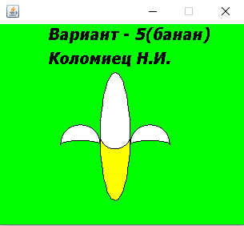

# NIK_lab5

| Фамилия, имя студента | Группа    | Дисциплина  |Тема                              
| --------------------- |:---------:| ------------|:--------------------------------:|
| Коломиец Никита       | ИС-302    | СВП         |Работа с графикой и системой

Как выглядит визуально выглядит программа: 

